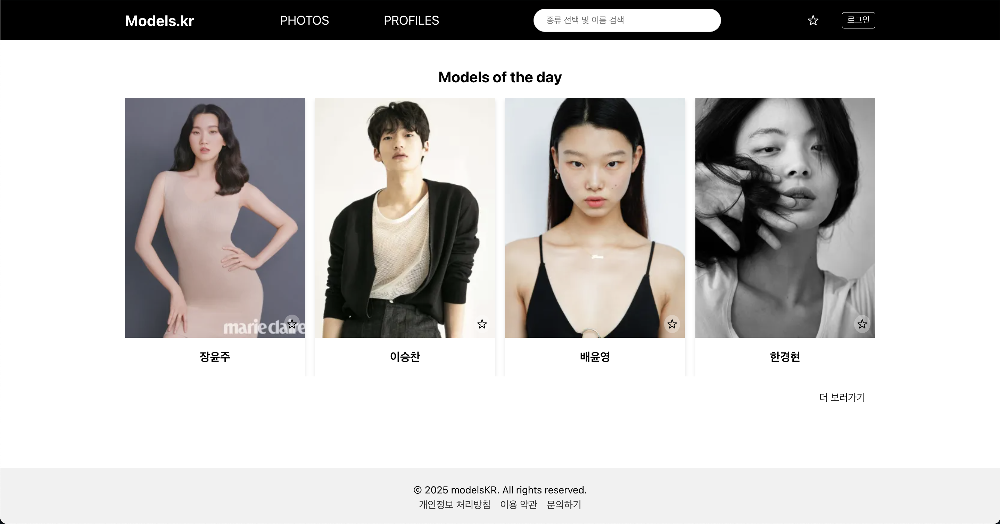
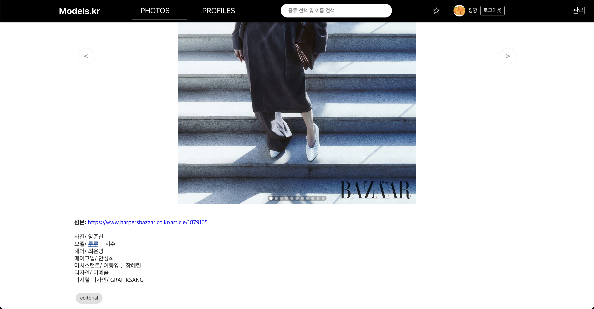

# modelsKR(가제)

한국 모델, 사진 산업에 특화된 인물 기반 포트폴리오 플랫폼입니다.  
모델, 포토그래퍼, 에이전시, 사진 정보를 탐색하고, 즐겨찾기 기능을 통해 북마크할 수 있습니다.

## 주요 기능

- 모델 / 포토그래퍼 등 아티스트 / 에이전시 / 포토 리스트 및 상세 페이지
- 서버 기반 필터링 (키, 카테고리 등)
- 검색 기능 (키워드)
- 즐겨찾기(Favorite) 기능
- 관리자 페이지 (권한 기반)
- 반응형 UI / 페이지네이션 / React Query, Redis 기반 캐싱

## 배포 링크

- Frontend (Vercel): https://modelskr.vercel.app/
- Backend (Railway): https://modelskr-backend-production.up.railway.app/

## 스크린샷





## 기술 스택

### Frontend

- React, React Router, React Query, Styled-components
- Vercel 배포

### Backend

- Node.js, Express, MongoDB, Mongoose, Cloudinary
- Redis (캐싱), Railway 배포

## 로컬 실행 방법

```bash
# 프론트
cd modelskr
npm install
npm start

# 백엔드
cd modelskr-backend
npm install
npm run dev

```

## 개발자 노트

### 기획 배경

- 기존 모델링/포토그래퍼 정보 플랫폼이 해외 기반이라 한국 중심의 플랫폼이 필요하다고 느껴 기획
- photos 탭을 통해 모델/아티스트와 작업물을 사이트 내에서 빠르게 확인할 수 있다.

### 기술적 도전과 해결

- Redux 기반 상태 관리에서 api 통신과 redux의 양측을 활용하는 구조로 개선
- 클라이언트 기반 필터링에서 서버 기반 쿼리 방식으로 전환하며 성능과 확장성 개선
- React Query를 도입해 데이터 캐싱과 비동기 처리 효율화
- 실사용을 목표로 Redis, E-tag를 활용한 최근 작업 캐싱 구조 구현, 중복 컨트롤러 로직을 유틸 함수로 리팩토링
- 이미지 관리를 위해 주소 기반에서 Cloudinary로 변경
- Lighthouse를 통한 점검 및 lazy/code spliting 적용
- OAuth 도입 및 토큰 관리(인증, 만료 및 손상 시 처리)

### 프로젝트 구조 및 운영

- 프론트와 백엔드 레포를 분리해 Vercel / Railway에 독립 배포
- GitHub Issues로 작업 관리하며 실무 스타일 협업 연습
- 실배포를 고려한 환경 변수, 에러 핸들링, 비동기 데이터 구조 설계
- SEO 관리 및 search console을 이용한 구글 검색 노출

### 회고

- 혼자서 기획, 디자인, 백엔드, 프론트까지 풀스택으로 운영해보며 전반적인 서비스 개발 프로세스를 경험
- 기능 중심에서 점차 구조적 사고와 유지보수성을 고려한 개발자로 성장 중이라고 느꼈음
- 개발/협업을 위한 소프트웨어 공학과 설계의 중요성을 느낌
- 이번 프로젝트를 통해 React Query, Express, MongoDB, Redis, Cloudinary 등 실제 실무 기술들을 직접 다뤄볼 수 있었음
- 프로젝트 중 마주한 문제들과 해결 과정을 [블로그](https://blog.naver.com/stoppedby1)에 기록하며 사고를 정리하고, 개발자로서의 성장을 도모했다.

---

## 향후 계획

- 참여 기반 UX 개선 (사용자의 추가/수정 요청)
- 관리자 통계 대시보드 추가
- 에러 관리를 위한 Sentry 도입 고려
- 홍보 및 직접 운영하며 사용자 요구사항 반영
